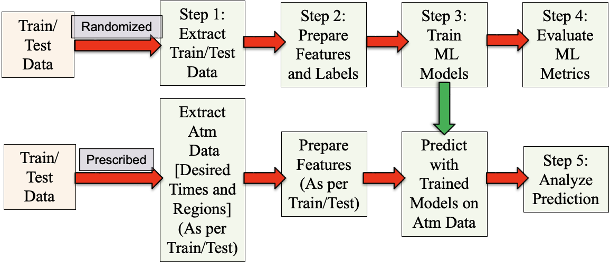
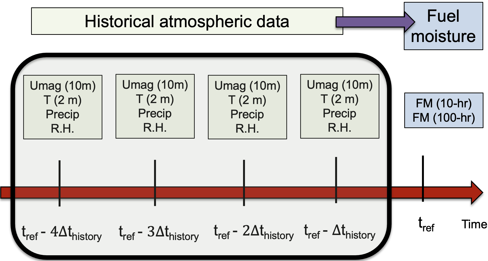
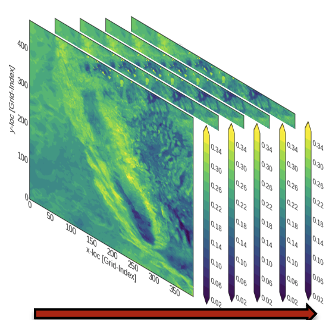
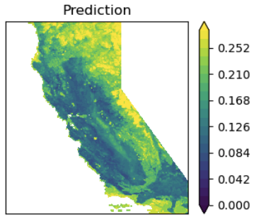

# Machine Learning Automation Pipeline (MLAP)

MLAP is a software framework for predicting wildfire **fuel moisture** (FM) from
historical atmospheric conditions. It provides a computationally cheap
alternative to transport-based methods, making it practical to assess many
scenarios rather than a handful.

Accurate FM prediction matters because fuel moisture governs ignition risk, rate
of spread, and the potential for a fire to intensify — which in turn drives
planning and protection decisions for wildlands, populations, and infrastructure.

Every stage is driven by a JSON input file, so large parametric studies can be
run and interpreted without hand-editing code.

## The pipeline

/// caption
The stages of MLAP. The upper path trains on *randomized* data; the lower path
applies a trained model to *prescribed* data to produce fuel maps.
///

| Step | Purpose | Guide |
|---|---|---|
| 1 | Extract a subsampled training set from 21 years of raw data | [Extract Data](user-guide/step1-extract.md) |
| 2 | Build features and labels for regression or classification | [Prepare Data](user-guide/step2-prepare.md) |
| 3 | Train ML models and compute metrics | [Train Models](user-guide/step3-train.md) |
| 4 | Compare many models across many datasets | [Evaluate Models](user-guide/step4-evaluate.md) |
| 5 | Predict FM at a chosen time and region | [Analyze and Predict](user-guide/step5-analyze.md) |

New users should start with [Installation](user-guide/installation.md), then work
through the steps in order. The [JSON Reference](user-guide/json-reference.md)
documents every input parameter in one searchable place.

## How the prediction is framed

FM at a reference time \(t_{ref}\) and location \((x, y)\) is related to the
time history of atmospheric quantities preceding it. Two parameters define that
history: `max_history_to_consider` (\(t_{max\_history}\), how far back to look)
and `history_interval` (\(t_{history}\), how often to sample within that window).

/// caption
MLAP relates instantaneous FM at \(t_{ref}\) to the history of atmospheric
parameters back to \(t_{max\_history}\), sampled every \(t_{history}\).
///

For example, with \(t_{max\_history} = 48\) hours and \(t_{history} = 4\) hours,
atmospheric data are taken at \(t_{ref}-4, t_{ref}-8, \ldots, t_{ref}-48\).

The work focuses on **10-hour dead fuel moisture**, which is the most widely
measured category and correlates well with overall wildfire potential. The 1-hour,
100-hour, and 1000-hour categories can be studied the same way.

## Source data

Training data is an hourly FM and atmospheric reanalysis product covering
California and parts of Nevada at **3 km spatial and 1 hour temporal resolution,
spanning 2000–2020 (21 years)**.

It is the output of a fuel moisture data assimilation system combining a coupled
atmosphere–fire model with observations from Remote Automatic Weather Stations
(Farguell et al., 2024).

/// caption
Historical atmospheric data for California, 2000–2020. Each slice is one hour;
the red arrow is time and the color bar shows FM.
///

## What you get out

The end product is a fuel map at a chosen time and region, produced by applying a
trained model to prescribed data.

/// caption
A fuel map obtained from a trained ML model at a prescribed time over a
prescribed region.
///

Predictions are not limited to the training domain. A trained model can be
applied to weather data outside the temporal and spatial range it was trained on
— including forecasts and other climate scenarios — provided the required
atmospheric variables are available and mapped in the extract step.

## Scientific results

The [Science](science/overview.md) section documents what the simulations show:
how prediction accuracy responds to data sampling, history parameters, ML
hyperparameters, and the choice of physical quantities.

## Design assessment

!!! success "Independently reviewed — 8/10 for automation design"

    MLAP's naming conventions exist to keep large parametric studies
    interpretable long after they are run. An independent review tested that
    claim directly: given **594 MB of accumulated output** and no access to the
    machine that produced it, could every number be traced back to the
    configuration that generated it?

    - **~8,600 output files** across 27 evaluation collections — every artifact
      traceable to its dataset, label, and model from filenames alone
    - **Two independently assembled collections cross-validated** — dataset 41
      reports an identical R² of 0.8906 in both, agreement that was not designed
      in
    - **Fourteen parameter studies** existing only as output, never written up,
      were recovered in full — including the largest hyperparameter effect in the
      assessment

    [Read the full assessment](design-assessment.md){ .md-button .md-button--primary }

## Citing and licensing

MLAP is developed at Lawrence Livermore National Laboratory.

- **Release ID:** LLNL-CODE-2001016
- **Title:** Machine Learning Automation Pipeline (MLAP), v 1.0
- **Author:** Pankaj K. Jha
- **License:** MIT
- **Repository:** <https://github.com/LLNL/MLAP>

Contact: Pankaj K. Jha — pankaj.psu@gmail.com (primary), jha3@llnl.gov

!!! note "Sponsorship"
    This work was performed under the auspices of the U.S. Department of Energy
    by Lawrence Livermore National Laboratory under Contract DE-AC52-07NA27344
    and was supported by the LLNL-LDRD Program under Project No. 22-SI-008.
