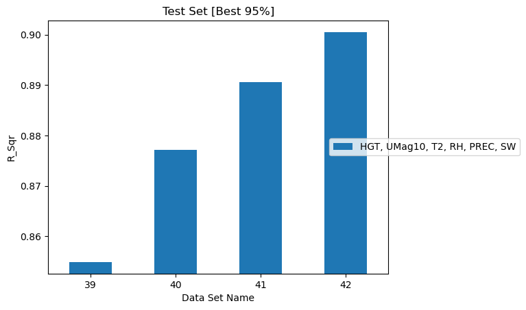
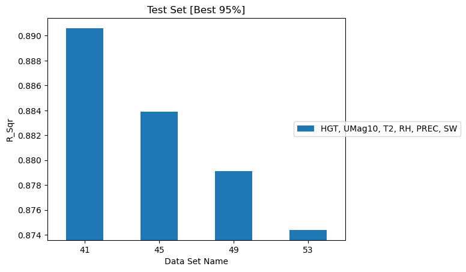

# Data Sampling

The raw dataset spans 21 years of hourly data on a 3 km grid — far more than can
be trained on directly. [Step 1](../user-guide/step1-extract.md) subsamples it in
time and space. How much of each is needed?

Each row of an extracted dataset is one **(reference time, grid point)** pair, so
total rows is the product of the two sample counts. The two axes turn out to
behave quite differently.

## Effect of spatial data size

*Source: `eval_003_spatial_data_effect`*

Four datasets were extracted with the number of sampled reference times held at
2,000 and the number of grid points per time varied from 1,000 to 4,000.
Everything else — 32 h maximum history, 4 h history interval, the same five
quantities of interest — was identical.

| Dataset | Reference times | Grid points | Rows | R² (test p95) | R² (test) |
|---|---|---|---|---|---|
| 39 | 2,000 | 1,000 | 2,000,000 | 0.8549 | 0.7752 |
| 40 | 2,000 | 2,000 | 4,000,000 | 0.8772 | 0.8036 |
| 41 | 2,000 | 3,000 | 6,000,000 | 0.8906 | 0.8216 |
| 42 | 2,000 | 4,000 | 8,000,000 | 0.9005 | 0.8350 |

Accuracy **increases monotonically** with spatial sample size, and the gain is
substantial — 0.8549 to 0.9005 in R², about 4.6 percentage points for four times
the grid points. The gain is decelerating but has not flattened by 4,000 points,
suggesting further sampling would still help.

/// caption
Correlation between ground truth and predicted FM for datasets varying in spatial
sample size.
///

More grid points means more of the landscape's topographic variety — mountains,
valleys, coastline — is represented, which is what the model needs to generalize
across the domain.

## Effect of temporal data size

*Source: `eval_002_temporal_data_effect`*

Four datasets were extracted with grid points held at 3,000 and reference times
varied from 2,000 to roughly 5,000.

| Dataset | Reference times | Grid points | Rows | R² (test p95) | R² (test) | RMSE (test) |
|---|---|---|---|---|---|---|
| 41 | 2,000 | 3,000 | 6,000,000 | 0.8906 | 0.8216 | 0.0288 |
| 45 | 3,000 | 3,000 | 9,000,000 | 0.8839 | 0.8131 | 0.0294 |
| 49 | 3,999 | 3,000 | 11,997,000 | 0.8791 | 0.8064 | 0.0296 |
| 53 | 4,999 | 3,000 | 14,997,000 | 0.8744 | 0.8001 | 0.0301 |

Accuracy **decreases monotonically** as more reference times are added, even
though total row count rises from 6 to 15 million.

!!! warning "This corrects the manuscript"
    The fuel moisture assessment manuscript states that "as the number of sampled
    data files increases, the R2 increases." The simulation output shows the
    opposite, consistently across every metric: R² falls on train
    (0.9748 → 0.9718), test (0.8216 → 0.8001) and test p95
    (0.8906 → 0.8744), while RMSE rises (0.0288 → 0.0301).

    **The manuscript text needs correcting**, not the documentation.

/// caption
Correlation between ground truth and predicted FM for datasets varying in
temporal sample size.
///

### Why the two axes differ

The contrast is the interesting part: adding rows *spatially* helps, adding them
*temporally* hurts.

A plausible reading is that the two kinds of sample are not equivalent. Grid
points drawn at a fixed set of times are spatially correlated — neighbouring
points share weather, and adding them fills in the landscape without making the
prediction problem harder. Additional reference times, by contrast, introduce
genuinely new weather regimes, seasons, and interannual conditions. That enriches
the training set but also makes the *test* set more diverse and harder, and R² is
measured against that harder target.

If so, the falling R² reflects a more demanding evaluation rather than a worse
model — but that interpretation is not established by these runs alone. A direct
test would hold the test set fixed while varying only the training sample.

!!! note "Consistency check"
    Dataset 41 (2,000 times × 3,000 grid points) appears in both studies and
    reports an identical R² of 0.8906 in each, confirming the two collections are
    measuring the same thing.

## Sampling order

[Step 1](../user-guide/step1-extract.md#spatial-sampling) can sample times first
and then grid points for each time (`"sample_first": "time"`), or the reverse.
The spatial-size study above used spatial-first sampling; the history studies
used temporal-first.

The manuscript raises the order of sampling as a question to assess. No
collection isolates it — no pair of datasets differs *only* in `sample_first` —
so its effect remains unquantified.

## Practical guidance

- Spend sample budget on **grid points** before reference times. The spatial axis
  showed clear, continuing returns; the temporal axis did not.
- Around **6 million rows** (2,000 times × 3,000 points) reaches R² ≈ 0.89, which
  is close to what the largest datasets studied here achieve.
- Small datasets are not disqualifying. The history studies below use 1 million
  rows and land at R² ≈ 0.87.
