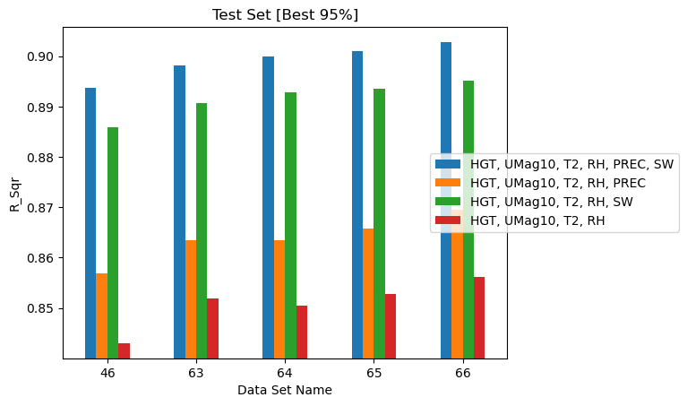
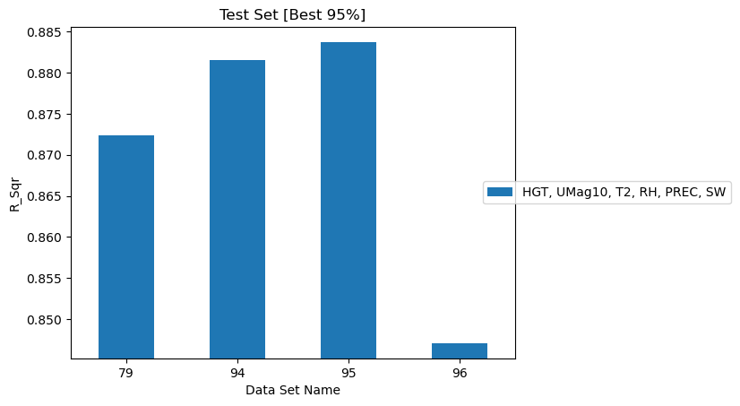

# Historical Data

MLAP predicts fuel moisture at a reference time from the history of atmospheric
conditions preceding it. Two parameters define that history:

- \(t_{max\_history}\) (`max_history_to_consider`) — how far back to look
- \(t_{history}\) (`history_interval`) — how often to sample within that window

Both drive feature count directly, so both trade accuracy against cost.

## Effect of maximum history

Five datasets were extracted with \(t_{history}\) fixed at 4 h and
\(t_{max\_history}\) varied from 32 to 48 hours. Each has 3,000 reference times
and 4,000 grid points — about 12 million rows.

| Dataset | \(t_{max\_history}\) | History times | Features | R² (test p95) | R² (test) |
|---|---|---|---|---|---|
| 46 | 32 h | 8 | 41 | 0.8937 | 0.8257 |
| 63 | 36 h | 9 | 46 | 0.8981 | 0.8317 |
| 64 | 40 h | 10 | 51 | 0.9000 | 0.8331 |
| 65 | 44 h | 11 | 56 | 0.9010 | 0.8354 |
| 66 | 48 h | 12 | 61 | 0.9028 | 0.8383 |

Accuracy increases monotonically with history length — but barely. Going from 32
to 48 hours raises R² from 0.8937 to 0.9028, about **one percentage point for a
50% increase in the number of history times** and a rise from 41 to 61 features.

/// caption
Correlation between ground truth and predicted FM for datasets varying in maximum
history.
///

The physics is sensible — more history covers more of the drying and wetting
cycle a fuel element has experienced — but the returns do not justify the cost
for 10-hour fuels. **\(t_{max\_history} = 32\) h is the recommended baseline.**

Larger fuel categories equilibrate more slowly, so 100-hour and 1000-hour fuels
would be expected to need longer windows. That has not been tested.

## Effect of history interval

Four datasets were extracted with \(t_{max\_history}\) fixed at 32 h and
\(t_{history}\) varied. These use 1,000 reference times and 1,000 grid points —
1 million rows, an order of magnitude smaller than the datasets above, yet
landing in a similar accuracy range.

| Dataset | \(t_{history}\) | History times | Features | R² (test p95) | R² (test) |
|---|---|---|---|---|---|
| 96 | 8 h | 4 | 21 | 0.8471 | 0.7633 |
| 79 | 4 h | 8 | 41 | 0.8724 | 0.7978 |
| 94 | 2 h | 16 | 81 | 0.8815 | 0.8088 |
| 95 | 1 h | 32 | 161 | 0.8837 | 0.8112 |

The response is **asymmetric around the 4-hour baseline**:

- Refining from 4 h to 1 h gains about 1 percentage point (0.8724 → 0.8837) for
  **four times** the history times and four times the features — a poor trade.
- Coarsening from 4 h to 8 h costs about 2.5 percentage points
  (0.8724 → 0.8471) — a sharp drop.

/// caption
Correlation between ground truth and predicted FM for datasets varying in history
interval.
///

At \(t_{history} = 8\) h only four historical times remain, which is evidently
too coarse to resolve the diurnal cycle that drives 10-hour fuel moisture. The
4-hour interval sits just on the right side of that cliff.

**\(t_{history} = 4\) h is the recommended baseline** — finer sampling costs a
great deal for very little, and coarser sampling degrades quickly.

## Combined guidance

The baseline used throughout the rest of this assessment is
\(t_{max\_history} = 32\) h with \(t_{history} = 4\) h, giving 8 historical times
and 41 features with five quantities of interest plus elevation.

| If you want | Change |
|---|---|
| Highest accuracy, cost no object | \(t_{max\_history} = 48\) h, \(t_{history} = 1\) h |
| Balanced default | \(t_{max\_history} = 32\) h, \(t_{history} = 4\) h |
| Cheapest defensible | \(t_{max\_history} = 32\) h, \(t_{history} = 4\) h — do **not** coarsen to 8 h |

Note that the two parameters were varied independently, never jointly, so any
interaction between them is unmeasured.
