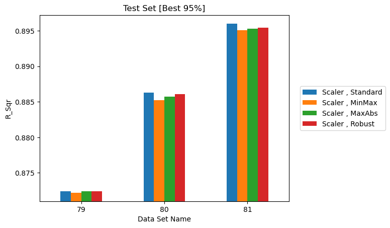
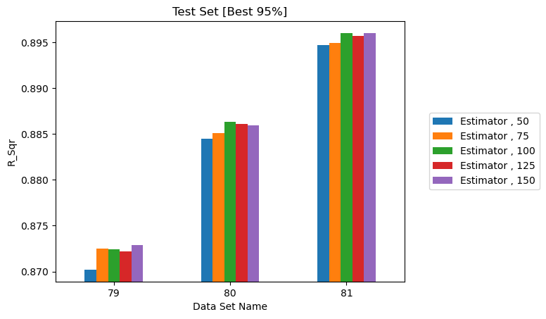
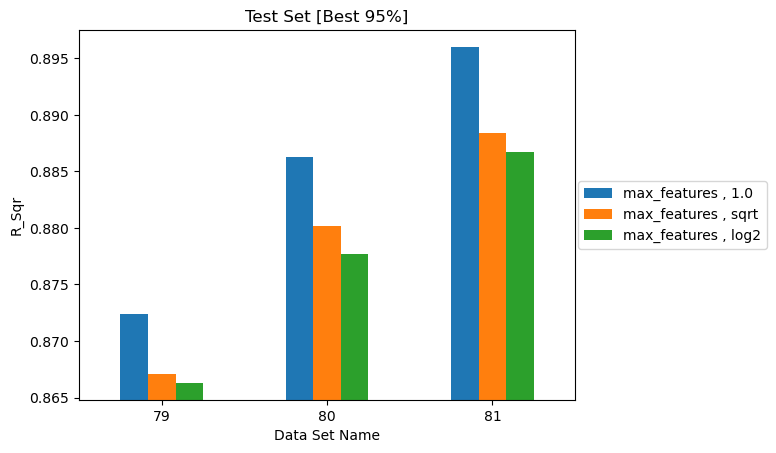
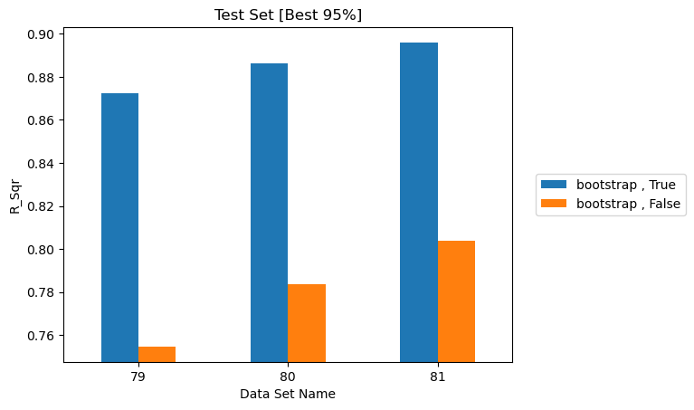

# Random Forest Parameters

How much do the hyperparameters of the Random Forest actually matter?

Random Forest is the baseline model for this assessment — the trends in
[Data Sampling](data-sampling.md), [Historical Data](history.md) and
[Physical Quantities](physical-quantities.md) were all established with it. This
page asks which of its own settings are worth tuning.

The [Multi-layer Perceptron](mlp.md) is covered separately.

!!! info "Derived from the archive"
    Every number on this page comes from the Step 4 metric CSVs. The collection
    backing each study is named beneath its heading.

All studies here use the same three datasets, which differ only in spatial sample
size, with \(t_{max\_history} = 32\) h and \(t_{history} = 4\) h:

| Dataset | Reference times | Grid points | Rows |
|---|---|---|---|
| 79 | 1,000 | 1,000 | 1,000,000 |
| 80 | 1,000 | 1,500 | 1,500,000 |
| 81 | 1,000 | 2,002 | 2,002,000 |

Reporting three datasets rather than one matters: a hyperparameter effect that
does not reproduce across all three is not a real effect.

!!! warning "Reading the plots below"
    The bar charts in this section are generated with an automatically scaled
    y-axis that does **not** start at zero, so small differences look large. All
    four span a range of roughly 0.03 in R². Read the tables for magnitude and
    the plots for ordering and consistency across datasets.

## Effect of data scaling

*Source: `eval_014_RF_scaling_effect`*

| Scaler | Dataset 79 | Dataset 80 | Dataset 81 |
|---|---|---|---|
| `Standard` | 0.8724 | 0.8863 | 0.8960 |
| `MinMax` | 0.8722 | 0.8852 | 0.8951 |
| `MaxAbs` | 0.8724 | 0.8857 | 0.8953 |
| `Robust` | 0.8724 | 0.8861 | 0.8954 |

/// caption
R² on the best 95% of test data for four scalers across datasets 79, 80 and 81.
///

Scaling makes **no meaningful difference** — the spread is under 0.001 on every
dataset, far below the difference between datasets.

This is expected. Random Forest splits on feature *ordering*, not magnitude, so
any monotonic rescaling leaves the tree structure essentially unchanged. Scaling
matters for distance- and gradient-based models such as SVM and MLP; for tree
ensembles it is close to a no-op.

## Effect of the number of estimators

*Source: `eval_015_RF_estimator_effect`*

| `n_estimators` | Dataset 79 | Dataset 80 | Dataset 81 |
|---|---|---|---|
| 50 | 0.8702 | 0.8845 | 0.8947 |
| 75 | 0.8725 | 0.8851 | 0.8949 |
| 100 *(default)* | 0.8724 | 0.8863 | 0.8960 |
| 125 | 0.8722 | 0.8861 | 0.8957 |
| 150 | 0.8729 | 0.8859 | 0.8960 |

/// caption
R² on the best 95% of test data for 50 to 150 trees. Within each dataset the
bars are almost indistinguishable; nearly all the visible variation is between
datasets.
///

Accuracy rises slightly from 50 to 100 trees, then **plateaus completely**. Going
from 100 to 150 changes R² by at most 0.0001 while costing 50% more training time.

The scikit-learn default of 100 is a good choice here. There is no benefit to
tuning this upward.

## Effect of `max_features`

*Source: `eval_016_RF_max_features_effect`*

| `max_features` | Dataset 79 | Dataset 80 | Dataset 81 |
|---|---|---|---|
| `1.0` *(all features)* | 0.8724 | 0.8863 | 0.8960 |
| `"sqrt"` | 0.8671 | 0.8802 | 0.8884 |
| `"log2"` | 0.8663 | 0.8777 | 0.8867 |

/// caption
R² on the best 95% of test data for `1.0`, `sqrt` and `log2`. The ordering is
the same on all three datasets.
///

Using **all** features at each split is consistently best, by about 0.008–0.009
over `sqrt` and slightly more over `log2`. The ordering holds on all three
datasets, and the margin grows with dataset size.

This is worth noting because `sqrt` is the scikit-learn default for
*classification* — applying that habit to this regression problem would cost
close to a percentage point.

## Effect of `bootstrap`

*Source: `eval_017_RF_bootstrap_effect`*

| `bootstrap` | Dataset 79 | Dataset 80 | Dataset 81 |
|---|---|---|---|
| `True` *(default)* | 0.8724 | 0.8863 | 0.8960 |
| `False` | 0.7546 | 0.7836 | 0.8037 |

/// caption
R² on the best 95% of test data with bootstrap sampling enabled and disabled.
This is the only Random Forest setting whose effect is visible at a glance.
///

This is the **single largest hyperparameter effect in the entire assessment**.
Disabling bootstrap costs 9–12 percentage points of R².

With `bootstrap=False` every tree is fitted on the identical full dataset. The
trees become highly correlated, and averaging correlated predictors recovers
almost none of the variance reduction that makes a forest work. Bootstrap
sampling is what makes the ensemble an ensemble.

**Leave `bootstrap` at `True`.**

## Random Forest summary

| Parameter | Recommendation | Cost of getting it wrong |
|---|---|---|
| `bootstrap` | `True` | Severe — up to 12 points of R² |
| `max_features` | `1.0` | Moderate — about 1 point |
| `n_estimators` | 100 | Negligible above 100 |
| `scaler_type` | Any | None |

Only one of these four is worth thinking about.

## Practical guidance

1. **Start with Random Forest defaults.** They are a strong baseline for this
   problem, and beat every [MLP configuration](mlp.md) tested with no tuning.
2. **Check `bootstrap` and `max_features`.** They are the only Random Forest
   settings that move the result.
3. **Do not spend effort on scaling for tree models.** It changes nothing.
4. **Compare train against test, not test alone.** A near-zero gap means
   underfitting and is diagnosed quite differently from a large one — that single
   comparison is what identified the
   [MLP problem](mlp.md#why-the-mlp-underperforms-random-forest).
5. **Validate hyperparameter findings across several datasets.** An effect that
   appears on one dataset and not the others is not an effect.
