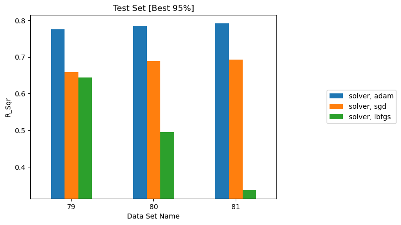
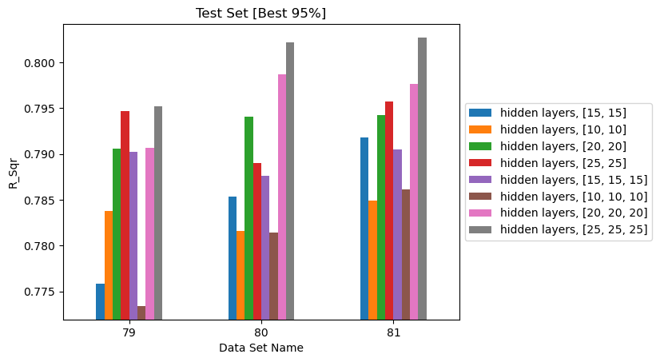
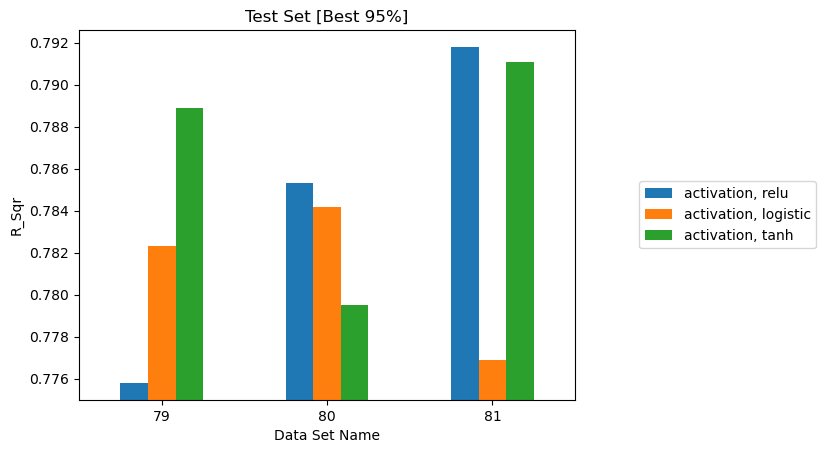
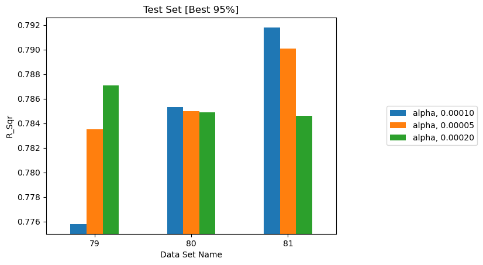
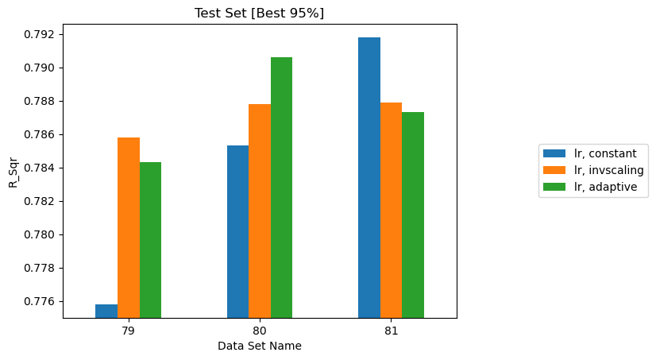
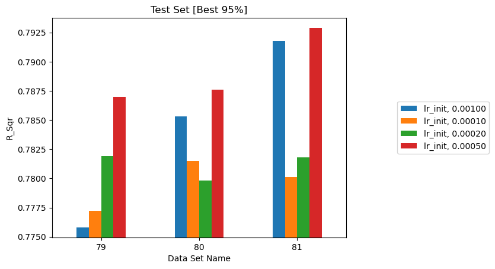
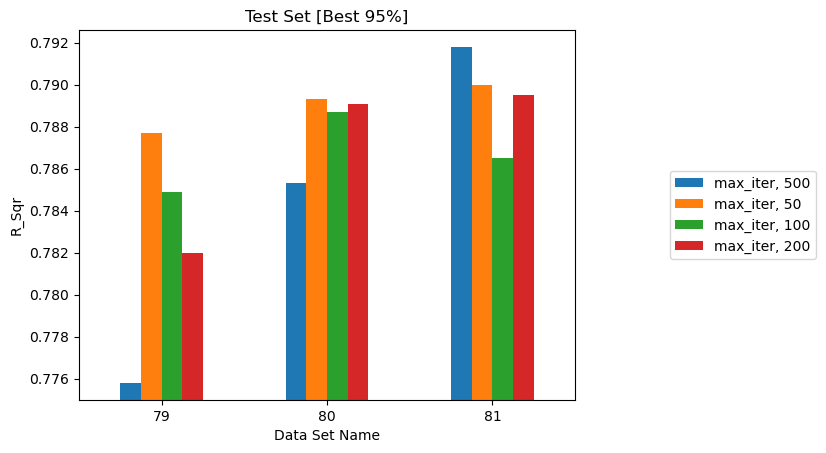
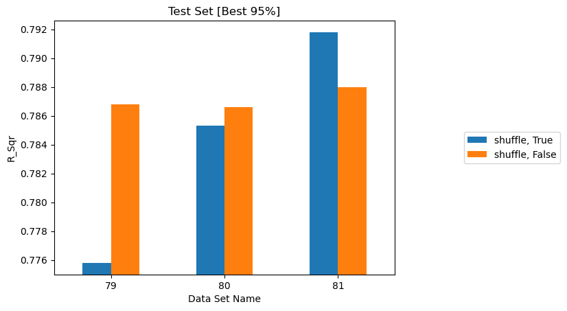

# Multi-layer Perceptron

A study of the eight Multi-layer Perceptron hyperparameters available in MLAP.

!!! info "What this study is for"
    The purpose of this study was to demonstrate that **MLAP can launch and
    interpret large parametric studies across more than one model type** — not
    to select a production model or to establish how well a neural network can
    predict fuel moisture.

    The MLP runs were carried out in limited time to show the framework's
    versatility. The accuracy reported here could be improved substantially with
    better choices of data and model parameters, and the numbers below should not
    be read as a verdict on neural networks for this problem.

## Relationship to the rest of the assessment

**Random Forest is the baseline throughout this assessment.** The trends in the
other studies were established with Random Forest, and the parameters chosen
there carry over into the MLP runs:

| Study | What it established |
|---|---|
| [Data Sampling](data-sampling.md) | How many reference times and grid points a dataset needs |
| [Historical Data](history.md) | \(t_{max\_history}\) = 32 h and \(t_{history}\) = 4 h as the working baseline |
| [Physical Quantities](physical-quantities.md) | Which atmospheric variables to include |
| [Random Forest Parameters](ml-parameters.md) | Which hyperparameters move the result for the baseline model |

The MLP study sits alongside those rather than extending them. It varies one
model's hyperparameters on fixed data, to show that the same automation handles
a second model family without change.

## Datasets used

All eight studies use the same three datasets as the
[Random Forest study](ml-parameters.md), differing only in spatial sample size,
with \(t_{max\_history} = 32\) h and \(t_{history} = 4\) h:

| Dataset | Reference times | Grid points | Rows |
|---|---|---|---|
| 79 | 1,000 | 1,000 | 1,000,000 |
| 80 | 1,000 | 1,500 | 1,500,000 |
| 81 | 1,000 | 2,002 | 2,002,000 |

Reporting three datasets rather than one matters: an effect that does not
reproduce across all three is not a real effect.

## Baseline configuration

The MLP was configured from the baseline in the software paper:
`hidden_layer_sizes` `[15, 15]`, `relu`, `adam`, `alpha` 1e-4, constant learning
rate, `learning_rate_init` 0.001, `max_iter` 500, `shuffle` true, `tol` 1e-3.
Each study varies one parameter from that baseline.

## MLP against Random Forest

On identical data, with both models at their defaults:

| Model | R² (test p95), dataset 81 |
|---|---|
| Random Forest, defaults | **0.8960** |
| MLP, baseline configuration | 0.7918 |

That gap of more than 10 percentage points is larger than any MLP hyperparameter
effect measured below, with the single exception of choosing a broken solver.
Its likely cause is examined in
[Why the MLP underperforms Random Forest](#why-the-mlp-underperforms-random-forest)
— and it appears to be a fixable configuration problem rather than a property of
the model.

!!! warning "Reading the plots below"
    The bar charts use an automatically scaled y-axis that does not start at
    zero. Apart from the `solver` plot, all of them span under 0.02 in R², so
    visually large differences are numerically small. Read the tables for
    magnitude.

## Effect of `solver`

| `solver` | Dataset 79 | Dataset 80 | Dataset 81 |
|---|---|---|---|
| `adam` | 0.7758 | 0.7853 | 0.7918 |
| `sgd` | 0.6588 | 0.6888 | 0.6924 |
| `lbfgs` | 0.6444 | 0.4946 | 0.3364 |

/// caption
R² on the best 95% of test data for three solvers. `lbfgs` degrades as the
dataset grows — the only reversed trend in the assessment.
///

`adam` is decisively best, and the failure of `lbfgs` is the striking result: it
gets **worse as the dataset grows**, collapsing from 0.64 to 0.34.

That direction is the opposite of every other trend in this assessment, and it is
the expected signature of a full-batch optimizer that has not converged. `lbfgs`
processes the entire dataset per iteration, so with `max_iter` fixed at 500 it
falls progressively further from convergence as rows are added. It is unsuited to
datasets of this size.

!!! note
    The manuscript flags this section as needing re-investigation. The pattern
    above is consistent with a convergence failure rather than a property of the
    solver itself — a rerun with a much larger `max_iter`, or with convergence
    warnings captured, would settle it.

**Use `adam`.**

## Effect of hidden layer sizes

| `hidden_layer_sizes` | Dataset 79 | Dataset 80 | Dataset 81 |
|---|---|---|---|
| `[10, 10]` | 0.7838 | 0.7816 | 0.7849 |
| `[15, 15]` *(baseline)* | 0.7758 | 0.7853 | 0.7918 |
| `[20, 20]` | 0.7906 | 0.7941 | 0.7942 |
| `[25, 25]` | 0.7947 | 0.7890 | 0.7957 |
| `[10, 10, 10]` | 0.7734 | 0.7814 | 0.7861 |
| `[15, 15, 15]` | 0.7902 | 0.7876 | 0.7905 |
| `[20, 20, 20]` | 0.7907 | 0.7987 | 0.7976 |
| `[25, 25, 25]` | 0.7952 | 0.8022 | **0.8027** |

/// caption
R² on the best 95% of test data for eight architectures, two and three layers
deep.
///

Larger networks do better, with `[25, 25, 25]` best on all three datasets. But
the whole range spans only about 0.018 in R², and even the best MLP configuration
(0.8027) remains far below an untuned Random Forest (0.8960).

The trend has not flattened at three layers of 25, so wider or deeper networks
might improve further — though closing a 10-point gap by architecture search
alone looks unlikely.

## Effect of `activation`

| `activation` | Dataset 79 | Dataset 80 | Dataset 81 |
|---|---|---|---|
| `relu` *(baseline)* | 0.7758 | 0.7853 | 0.7918 |
| `logistic` | 0.7823 | 0.7842 | 0.7769 |
| `tanh` | 0.7889 | 0.7795 | 0.7911 |

/// caption
R² on the best 95% of test data for three activation functions.
///

**No reliable winner.** `tanh` leads on dataset 79, `relu` on 81, and `logistic`
on neither — the ordering changes with the dataset. The spread is comparable to
run-to-run noise, so this choice does not matter at this network size.

## Effect of `alpha`

| `alpha` (L2 penalty) | Dataset 79 | Dataset 80 | Dataset 81 |
|---|---|---|---|
| 5e-5 | 0.7835 | 0.7850 | 0.7901 |
| 1e-4 *(baseline)* | 0.7758 | 0.7853 | 0.7918 |
| 2e-4 | 0.7871 | 0.7849 | 0.7846 |

/// caption
R² on the best 95% of test data for three L2 penalty strengths.
///

**No effect.** The ordering reverses between datasets 79 and 81, and the whole
spread is under 0.008. Regularization strength is not a lever here — which is
unsurprising given the network is not overfitting in the first place (see
[below](#why-the-mlp-underperforms-random-forest)).

## Effect of `learning_rate`

| `learning_rate` | Dataset 79 | Dataset 80 | Dataset 81 |
|---|---|---|---|
| `constant` *(baseline)* | 0.7758 | 0.7853 | 0.7918 |
| `invscaling` | 0.7858 | 0.7878 | 0.7879 |
| `adaptive` | 0.7843 | 0.7906 | 0.7873 |

/// caption
R² on the best 95% of test data for three learning-rate schedules.
///

**No effect.** All three schedules land within 0.005 of each other, with no
consistent ordering. Note that `adam` adapts its own step sizes, so the
`learning_rate` schedule has limited influence with this solver.

## Effect of `learning_rate_init`

| `learning_rate_init` | Dataset 79 | Dataset 80 | Dataset 81 |
|---|---|---|---|
| 1e-4 | 0.7772 | 0.7815 | 0.7801 |
| 2e-4 | 0.7819 | 0.7798 | 0.7818 |
| 5e-4 | 0.7870 | 0.7876 | **0.7929** |
| 1e-3 *(baseline)* | 0.7758 | 0.7853 | 0.7918 |

/// caption
R² on the best 95% of test data for four initial learning rates.
///

**The one parameter with a partly consistent signal.** The two larger values
(5e-4, 1e-3) beat the two smaller ones on all three datasets. The effect is
small — about 0.01 — but its direction holds, which is more than the other
parameters manage.

Smaller initial steps making things *worse* is itself informative: it points to
training that halts before convergence rather than one that overshoots.

## Effect of `max_iter`

| `max_iter` | Dataset 79 | Dataset 80 | Dataset 81 |
|---|---|---|---|
| 50 | 0.7877 | 0.7893 | 0.7900 |
| 100 | 0.7849 | 0.7887 | 0.7865 |
| 200 | 0.7820 | 0.7891 | 0.7895 |
| 500 *(baseline)* | 0.7758 | 0.7853 | 0.7918 |

/// caption
R² on the best 95% of test data for four iteration caps. Fifty iterations
performs as well as five hundred.
///

**Completely flat — and this is the most diagnostic result of the eight.**
Raising the iteration budget tenfold changes nothing. Training is therefore not
stopping because it ran out of iterations; it is stopping on the convergence
tolerance long before the cap. See
[below](#why-the-mlp-underperforms-random-forest).

## Effect of `shuffle`

| `shuffle` | Dataset 79 | Dataset 80 | Dataset 81 |
|---|---|---|---|
| `true` *(baseline)* | 0.7758 | 0.7853 | 0.7918 |
| `false` | 0.7868 | 0.7866 | 0.7880 |

/// caption
R² on the best 95% of test data with per-epoch shuffling on and off.
///

**No effect.** The difference is under 0.011 and changes sign between datasets.

## Summary of the eight studies

| # | Parameter | Values tested | Best (dataset 81) | Spread | Consistent across datasets? |
|---|---|---|---|---|---|
| 1 | `solver` | `adam`, `sgd`, `lbfgs` | `adam` — 0.7918 | **0.456** | **Yes — decisive** |
| 2 | `hidden_layer_sizes` | 8 architectures | `[25, 25, 25]` — 0.8027 | 0.018 | **Yes** |
| 3 | `learning_rate_init` | 1e-4 … 1e-3 | 5e-4 — 0.7929 | 0.013 | Partly |
| 4 | `activation` | `relu`, `logistic`, `tanh` | `relu` — 0.7918 | 0.015 | No |
| 5 | `alpha` | 5e-5, 1e-4, 2e-4 | 1e-4 — 0.7918 | 0.008 | No |
| 6 | `learning_rate` | constant, invscaling, adaptive | constant — 0.7918 | 0.005 | No |
| 7 | `max_iter` | 50, 100, 200, 500 | 500 — 0.7918 | 0.005 | No |
| 8 | `shuffle` | `true`, `false` | `true` — 0.7918 | 0.004 | No |

Only two of the eight produced an effect that reproduces across all three
datasets. Both are structural — which optimizer runs, and how much capacity the
network has — rather than fine-tuning. The remaining six vary by less than the
scatter between datasets.

The best MLP found anywhere in these studies is **0.8027**, against **0.8960**
for a Random Forest with no tuning at all on the same data.

## Why the MLP underperforms Random Forest

The natural assumption would be overfitting — a network memorising the training
set and generalising poorly. **The data say the opposite.**

Comparing the baseline MLP against Random Forest on dataset 79:

| | Train R² | Test R² | Gap | Train MSE |
|---|---|---|---|---|
| MLP (baseline) | 0.6832 | 0.6807 | **0.0025** | 0.0014 |
| Random Forest | 0.9713 | 0.7978 | 0.1735 | 0.0001 |

The MLP performs **no better on data it was trained on** than on data it has
never seen. It is not overfitting; it is **underfitting badly** — it never fits
the training set in the first place. Random Forest, by contrast, fits training
data almost perfectly and still generalises better despite a large gap.

This pattern holds across every configuration tested. Training R² on dataset 79
spans just **0.676 to 0.690** across all eight studies and roughly thirty
configurations — including the largest `[25, 25, 25]` network. Nothing that was
varied moved the training fit.

#### The likely cause: the convergence tolerance

`tol` is set to **1e-3**. The MLP's converged training MSE is **0.0014**.

scikit-learn stops training when the loss fails to improve by more than `tol`
for ten consecutive iterations. Here the tolerance is **roughly 70% of the
entire final loss** — an improvement that large is impossible after the first
few iterations, so the stopping criterion fires almost immediately.

Three observations corroborate this:

- **`max_iter` is flat.** Fifty iterations matches five hundred, so the
  iteration cap is never reached.
- **Bigger networks barely help.** Training R² moves only 0.676 → 0.701 from
  `[10, 10]` to `[25, 25, 25]`. Added capacity goes unused because training
  halts before it can be exploited.
- **Smaller initial learning rates hurt.** With a premature stop, slower
  progress per step means less progress overall.

The configured value is also **ten times looser than scikit-learn's default**
of 1e-4, which would itself be marginal at this loss scale.

!!! warning "These eight studies are provisional"
    Every MLP result on this page was produced under the same stopping
    criterion. If the tolerance is indeed halting training early, then all eight
    studies measured variation around a premature stopping point rather than the
    effect of the parameters themselves. **The comparison against Random Forest
    is not yet a fair one**, and the MLP conclusions should be treated as
    provisional until the runs are repeated.

#### Contributing factors

Two further points are worth noting, though neither explains a gap this large:

**Tree ensembles suit this problem.** The features are 8 history times × 5
quantities, so they are strongly autocorrelated — consecutive history steps carry
nearly the same information. Trees handle correlated features and sharp
thresholds natively, whereas an MLP must learn those interactions from data.

**Scaling matters for one model and not the other.** Random Forest is
[unaffected by the scaler](ml-parameters.md#effect-of-data-scaling), but an MLP is sensitive to
it. The scaler choice was never varied jointly with MLP hyperparameters, so any
interaction between the two is unmeasured.

## Potential future studies with MLP

The MLP is not yet a fair comparison. In rough order of expected value:

| Study | Rationale |
|---|---|
| **Rerun with `tol` at 1e-6 or 0** | The single highest-value change. If premature stopping is the bottleneck, this alone may close much of the gap, and it costs one parameter change. |
| Use `early_stopping` with `validation_fraction` | Stops on validation score rather than a loss-improvement threshold, removing the dependence on an absolute tolerance calibrated to the label scale. |
| Repeat all eight studies afterwards | Their conclusions were drawn under the suspect criterion and need revisiting once training converges properly. |
| Extend the architecture search | `[25, 25, 25]` was the best and largest tested, and the trend had not flattened. Worth pushing further, but only after training actually converges. |
| Vary `scaler_type` jointly with MLP parameters | Scaling is irrelevant for Random Forest but not for an MLP, and the interaction is currently unmeasured. |
| Revisit `lbfgs` with an adequate `max_iter` | Its collapse as data grows is consistent with non-convergence rather than unsuitability. Either confirm or rule that out. |

Until at least the first of these is done, the honest summary is that **Random
Forest outperforms the MLP as configured**, not that it outperforms MLPs on this
problem.

## MLP summary

| Parameter | Recommendation |
|---|---|
| `solver` | `adam` — the only choice that works as configured |
| `hidden_layer_sizes` | Larger helps; `[25, 25, 25]` was best tested |
| `tol` | **Reduce it.** At 1e-3 it appears to stop training prematurely |
| Everything else | No reliable effect measured — though that may be a consequence of the stopping problem rather than a property of the parameters |

