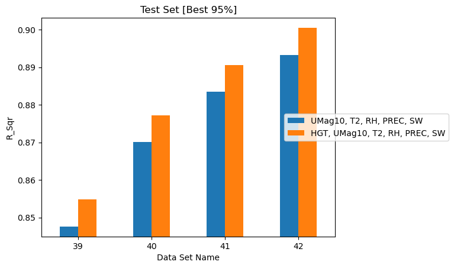
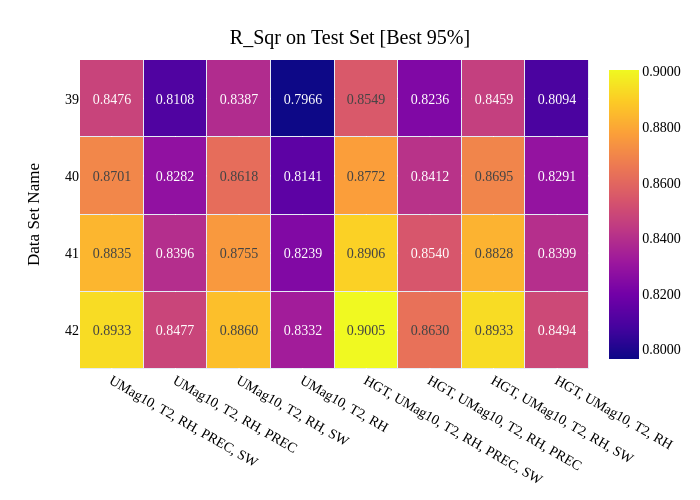
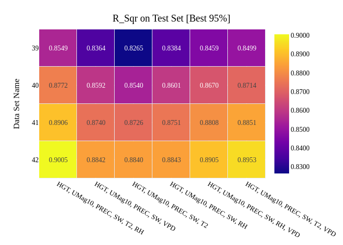

# Physical Quantities

Which atmospheric variables actually carry the fuel moisture signal? Every
quantity added multiplies through the history dimension — one more QoI at 8
historical times is 8 more features — so dropping an uninformative variable is
worth real compute.

These studies use datasets 39–42, which differ only in spatial sample size
(1,000 to 4,000 grid points at 2,000 reference times), with
\(t_{max\_history} = 32\) h and \(t_{history} = 4\) h. Varying the feature set
while holding the data fixed is exactly what
[`qois_for_training`](../user-guide/step3-train.md#choosing-features-for-training)
is for.

!!! note "Figures on this page"
    The elevation study compares two feature sets and is shown as a bar chart.
    The other two compare six and eight, which is too many to read as grouped
    bars, so they are shown as heatmaps with the values printed in each cell.
    Brighter is better in the heatmaps; the colour scale is shared within a
    figure but not between them.

## Effect of elevation

*Source: `eval_004_elevation_effect`*

Elevation (`HGT`) is the only feature that does not vary with time. Each dataset
was trained with and without it.

| Dataset | Grid points | Without `HGT` | With `HGT` | Gain |
|---|---|---|---|---|
| 39 | 1,000 | 0.8476 | 0.8549 | +0.0073 |
| 40 | 2,000 | 0.8701 | 0.8772 | +0.0071 |
| 41 | 3,000 | 0.8835 | 0.8906 | +0.0071 |
| 42 | 4,000 | 0.8933 | 0.9005 | +0.0072 |

Elevation gives a small but **remarkably consistent** benefit — almost exactly
+0.007 in R² regardless of dataset size. The stability of that number across four
independent datasets is itself evidence the effect is real rather than noise.

/// caption
Correlation between ground truth and predicted FM for datasets trained with and
without elevation.
///

At one feature out of 41, elevation is cheap. **Keep it.**

## Effect of precipitation and shortwave flux

*Source: `eval_005_precip_flux_effect`*

!!! info "Derived from the archive"
    The numbers in this section come from the Step 4 metric CSVs of the
    collection named above.

Precipitation (`PREC`) and downward shortwave flux (`SW`) were dropped
individually and together, from a base set of `HGT, UMag10, T2, RH`.

| Features | Dataset 39 | Dataset 40 | Dataset 41 | Dataset 42 |
|---|---|---|---|---|
| `HGT, UMag10, T2, RH, PREC, SW` | 0.8549 | 0.8772 | 0.8906 | 0.9005 |
| `HGT, UMag10, T2, RH, SW` (no `PREC`) | 0.8459 | 0.8695 | 0.8828 | 0.8933 |
| `HGT, UMag10, T2, RH, PREC` (no `SW`) | 0.8236 | 0.8412 | 0.8540 | 0.8630 |
| `HGT, UMag10, T2, RH` (neither) | 0.8094 | 0.8291 | 0.8399 | 0.8494 |

/// caption
R² on the best 95% of test data for all eight feature combinations across the
four datasets. The four darker columns are those without `SW`.
///

On dataset 42, relative to the full set:

- Dropping `PREC` costs **0.0072**
- Dropping `SW` costs **0.0375** — over five times as much
- Dropping both costs **0.0511**

**Shortwave downward flux is far more important than precipitation.** The
ordering is identical on all four datasets, and the same pattern reappears
independently in the [maximum history study](history.md#effect-of-maximum-history),
where dropping `SW` cost 0.0369 and dropping `PREC` cost 0.0079 on a completely
different set of datasets.

The physical reading is straightforward: solar flux drives the drying of fine
fuels directly and operates continuously, whereas precipitation is intermittent
and mostly zero in California outside the winter months. A variable that is zero
in the majority of samples carries little information for most predictions,
however decisive it is when it does occur.

!!! tip
    If feature count must be reduced, `PREC` is the cheapest thing to drop. `SW`
    is not.

## Temperature, humidity, and vapor pressure deficit

*Source: `eval_012_temp_rh_vpd`, which consolidates the six combinations also run
individually as `eval_006_replace_temp_rh_by_vpd`, `eval_007_drop_rh`,
`eval_008_drop_temp`, `eval_009_replace_temp_by_vpd` and
`eval_010_replace_rh_by_vpd`*

!!! info "Derived from the archive"
    The numbers in this section come from the Step 4 metric CSVs of the
    collection named above.

Vapor pressure deficit combines temperature and relative humidity into one
variable (see [Step 2](../user-guide/step2-prepare.md#derived-features)). If VPD
could replace both, the feature count would drop by one QoI — 8 features at the
baseline history settings. Six combinations were tested against a base set of
`HGT, UMag10, PREC, SW`.

| Additional features | Dataset 39 | Dataset 40 | Dataset 41 | Dataset 42 |
|---|---|---|---|---|
| `T2, RH` *(baseline)* | 0.8549 | 0.8772 | 0.8906 | **0.9005** |
| `T2, VPD` | 0.8499 | 0.8714 | 0.8851 | 0.8953 |
| `RH, VPD` | 0.8459 | 0.8670 | 0.8808 | 0.8905 |
| `RH` alone | 0.8384 | 0.8601 | 0.8751 | 0.8843 |
| `VPD` alone | 0.8364 | 0.8592 | 0.8740 | 0.8842 |
| `T2` alone | 0.8265 | 0.8540 | 0.8726 | 0.8840 |

/// caption
R² on the best 95% of test data for six combinations of `T2`, `RH` and `VPD`,
each added to a base set of `HGT, UMag10, PREC, SW`. The leftmost column is the
`T2, RH` baseline, brightest on every row.
///

Three findings, all consistent across the four datasets:

**VPD does not replace temperature and humidity.** Substituting `VPD` for both
costs 0.0163 on dataset 42 (0.9005 → 0.8842). The combination of `T2` and `RH`
outperforms every alternative tested.

**VPD alone is no better than either input alone.** `VPD` (0.8842), `RH`
(0.8843) and `T2` (0.8840) are within 0.0003 of each other on dataset 42 — an
effective three-way tie. Whatever VPD gains by combining the two variables, it
loses by discarding their independent information.

**The best substitution keeps temperature.** `T2, VPD` (0.8953) recovers most of
the baseline and clearly beats `RH, VPD` (0.8905), suggesting the residual signal
in `T2` that VPD does not capture is more valuable than the equivalent in `RH`.

### Is the substitution worth it?

| Option | R² (dataset 42) | QoIs | Features at baseline history |
|---|---|---|---|
| `T2, RH` | 0.9005 | 6 | 49 |
| `T2, VPD` | 0.8953 | 6 | 49 |
| `VPD` alone | 0.8842 | 5 | 41 |

Replacing `T2, RH` with `VPD` alone saves 8 features — about 16% — for 1.6
percentage points of R². Whether that trade is worth taking depends on the
application, but the motivating hope that VPD would be a *free* consolidation is
not supported by these runs.

## Summary

| Variable | Verdict |
|---|---|
| `SW` (shortwave flux) | Important — dropping costs ~0.037 |
| `T2` + `RH` together | Important — best available pairing |
| `HGT` (elevation) | Small but consistent gain, ~0.007, for one feature |
| `PREC` (precipitation) | Marginal — dropping costs ~0.007 |
| `VPD` | A viable economy, not a free win |

The recommended full feature set is
`HGT, UMag10, T2, RH, PREC, SW`, which is what the highest-scoring configuration
in every study on this page uses.

## Potential future studies

**Terrain ruggedness** is the natural next candidate. Elevation on its own
contributes a gain of about +0.007 that held to within 0.0002 across all four
datasets — small, but consistent enough to indicate the terrain carries real
signal. A ruggedness measure derived from the same elevation field would test
whether local slope and variability add anything beyond height alone, at a cost
of one further feature.

It needs no change to data extraction, since elevation is already read. The work
is a derived-feature computation in
[Step 2](../user-guide/step2-prepare.md#derived-features), alongside the existing
VPD calculation.

A second question the results above raise: `PREC` contributes little on average,
but California precipitation is concentrated in the winter months. Its marginal
contribution may be much larger in a winter-only dataset than the year-round
figure of 0.007 suggests — which would be tested by the seasonal-subset study.
