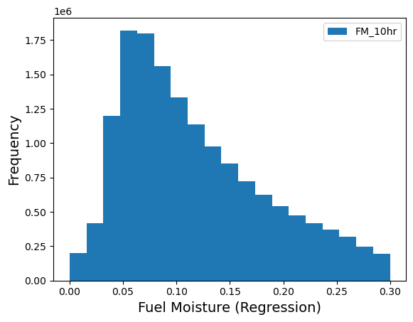
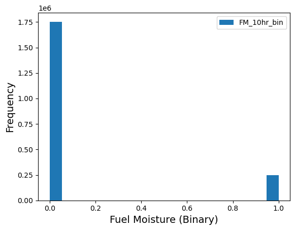
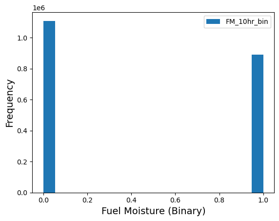
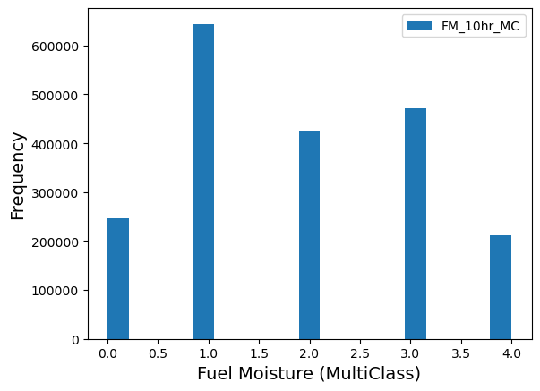

# Step 2: Prepare Data

**Driver:** `Step2_PrepareData/Prepare_TrainTest_Data.py`
**Config:** `json_prep_data_label.json`

```bash
python Prepare_TrainTest_Data.py json_extract_data.json json_prep_data_label.json
```

## What this step does

Step 1 produced raw atmospheric values with associated FM values. Step 2 turns
those into the **features** and **labels** an ML model consumes — selecting which
quantities to use, computing derived quantities, converting FM into the label
form the problem needs, and optionally pruning outliers.

Scaling is *not* done here; it happens in [Step 3](step3-train.md).

## Selecting features

`features.qois_to_use` picks which quantities become features. It is a subset of
the `qois_to_read` used during extraction, optionally plus `HGT`:

```json
"features": {
    "qois_to_use": ["HGT", "UMag10", "T2", "RH", "PREC", "SW"],
    "qois_derived": ["VPD"]
}
```

!!! note "Shortened names"
    `PREC` and `SW` are the prepared-data names for `PRECIP` and `SWDOWN`, which
    are what the raw and extracted data call them.

## Derived features

`qois_derived` requests quantities computed from extracted ones. Currently
**vapor pressure deficit (VPD)** is supported — the difference between saturation
and actual vapor pressure, derived from `T2` and `RH`.

VPD is attractive because it folds temperature and humidity into a single
variable that may be more directly relevant to fuel moisture, potentially
reducing the feature count without losing skill. Whether it actually does is
examined in [Physical Quantities](../science/physical-quantities.md).

It is computed from the Clausius–Clapeyron relation. With
\(dtt = T_2 - 273.16\):

$$
e_s = a_0 + dtt\,(a_1 + dtt\,(a_2 + dtt\,(a_3 + dtt\,(a_4 + dtt\,(a_5 + dtt\,(a_6 + dtt\,(a_7 + a_8\,dtt)))))))
$$

$$
e = e_s \cdot \frac{RH}{100}, \qquad VPD = e_s - e
$$

where \(e_s\) is saturation vapor pressure and \(e\) is vapor pressure. The
coefficients (Almgren et al., 2023) are:

| Coefficient | Value | | Coefficient | Value |
|---|---|---|---|---|
| \(a_0\) | 6.105851 | | \(a_5\) | 2.031998e-8 |
| \(a_1\) | 0.4440316 | | \(a_6\) | 6.936113e-11 |
| \(a_2\) | 1.430341e-2 | | \(a_7\) | 2.564861e-14 |
| \(a_3\) | 2.641412e-4 | | \(a_8\) | -3.704404e-16 |
| \(a_4\) | 2.995057e-6 | | | |

## Preparing labels

`FM_labels.label_type` selects the problem type. All three use the same extracted
data; they differ only in how FM values become labels.

### Regression

```json
"FM_labels": { "label_type": "Regression" }
```

Raw floating-point FM values are used directly — no further computation.



/// caption
Distribution of 10-hour fuel moisture in a randomized dataset from Step 1.
///

### Binary classification

```json
"FM_labels": {
    "label_type": "Binary",
    "FM_binary_threshold": 0.05
}
```

FM values **above** the threshold get label `0` (moist, not prone to wildfire);
values **at or below** get label `1` (dry, prone to wildfire).

The threshold materially changes class balance:

<div class="grid" markdown>

/// caption
`FM_binary_threshold` = 0.05
///


/// caption
`FM_binary_threshold` = 0.10
///
</div>

### Multi-class classification

```json
"FM_labels": {
    "label_type": "MultiClass",
    "FM_MC_levels": [0.0, 0.03, 0.06, 0.09, 0.12, 0.15, 0.19, 0.23, 0.27, 0.35, 1.0]
}
```

`FM_MC_levels` gives the class boundaries, which **need not be uniform**. The
list above assigns label `0` for \(0.0 \le FM < 0.03\), label `1` for
\(0.03 \le FM < 0.06\), and so on.



/// caption
Multi-class label distribution for a non-uniform set of FM levels, 10-hour fuel
moisture.
///

## Pruning outliers

ML methods often perform very differently across portions of the sample. Where a
clear cutoff exists, `prune_data` restricts training to a range:

```json
"prune_data": { "FM_10hr": [0.00001, 0.3] }
```

This keeps only rows where 10-hour FM falls in \([10^{-5}, 0.3]\). Pruning can be
applied to several variables at once, each with its own range.

!!! warning "Not the same as best-95% evaluation"
    Pruning removes rows from the **training** data. The `test_p95` and
    `test_p90` metrics in [Step 3](step3-train.md#evaluation-datasets) instead
    rank *predictions* by error and discard the worst. The two are unrelated.

## Sample configuration

```json
{
    "paths": { "prepared_data_base_loc": ".../02_TrainTest_Data_Prepared" },
    "label_defn": { "label_count": 6 },
    "FM_labels": {
        "label_type": "Regression",
        "FM_binary_threshold": 0.03,
        "FM_MC_levels": [0.0, 0.03, 0.06, 0.09, 0.12, 0.15, 0.19, 0.23, 0.27, 0.35, 1.0]
    },
    "features": {
        "qois_to_use": ["HGT", "UMag10", "T2", "RH", "PREC", "SW"],
        "qois_derived": ["VPD"]
    },
    "qoi_to_plot": { "FM_hr": 10 },
    "prune_data": { "FM_10hr": [0.00001, 0.3] }
}
```

`label_count` is the identifier for this prepared dataset, used throughout the
rest of the pipeline.

## Output

A prepared dataset containing the selected and derived features alongside labels
in the requested form, written under `prepared_data_base_loc`. This feeds
[Step 3](step3-train.md).
