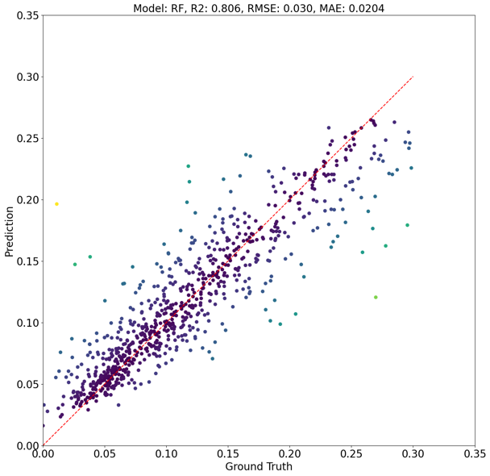
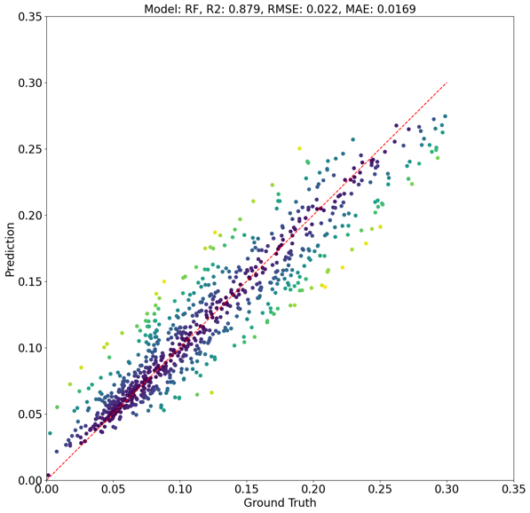
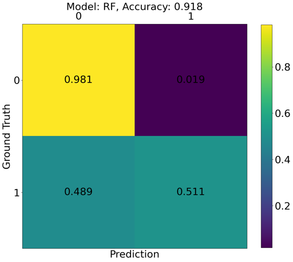
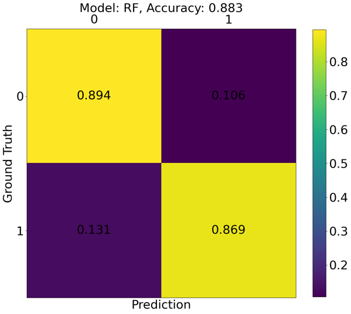
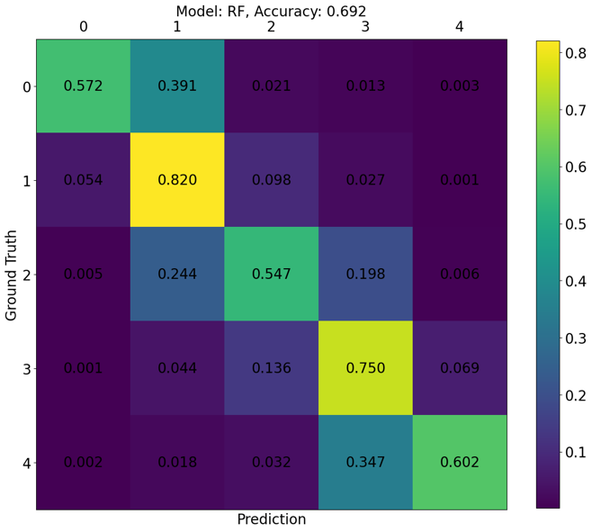

# Step 3: Train Models

**Driver:** `Step3_TrainModel/TrainModel.py`
**Config:** `json_train_model_<MODEL>.json`

```bash
python TrainModel.py json_extract_data.json json_prep_data_label.json json_train_model_RF.json
```

## What this step does

Step 3 scales the prepared data, splits it into train and test sets, fits a
model, and computes evaluation metrics and plots for that single
(dataset, label, model) combination.

Comparing *many* such combinations is [Step 4](step4-evaluate.md).

## Training options

```json
"train_options": {
    "train_from_scratch": true,
    "save_train_data": true,
    "save_test_data": true
}
```

| Parameter | Effect |
|---|---|
| `train_from_scratch` | `true` fits a new model; `false` loads an already-trained model matching the nomenclature and evaluates it |
| `save_train_data` | Retain the training split for later examination |
| `save_test_data` | Retain the test split for later examination |

Setting `train_from_scratch` to `false` is how you re-evaluate or re-plot without
paying to retrain.

## Scaling

Features arrive on wildly different scales — wind speed sits around
\([0, 15]\) m/s while temperature (WRF outputs Kelvin − 300) runs
\([-50, 20]\). Without scaling, distance-based and gradient-based models are
dominated by whichever feature happens to have the largest numeric range.

`scaler_type` selects the scikit-learn scaler:

| Value | Scaler |
|---|---|
| `"Standard"` | `StandardScaler` — zero mean, unit variance |
| `"MinMax"` | `MinMaxScaler` — rescale to a fixed range |
| `"MaxAbs"` | `MaxAbsScaler` — scale by maximum absolute value |
| `"Robust"` | `RobustScaler` — uses median and IQR, resistant to outliers |

An unrecognized value raises a `ValueError` rather than silently defaulting.

Which scaler to pick is examined in
[ML Parameters](../science/ml-parameters.md#effect-of-data-scaling).

## Train/test split

`test_data_frac` sets the fraction held out for testing. `0.2` means 20% test,
80% train.

## Available models

`model_name` selects the algorithm. The regression or classification variant is
chosen automatically from the `label_type` set in
[Step 2](step2-prepare.md#preparing-labels).

| `model_name` | Regression | Classification |
|---|---|---|
| `"Linear"` | `LinearRegression` | — |
| `"SVM"` | `SVR` | `SVC` |
| `"RF"` | `RandomForestRegressor` | `RandomForestClassifier` |
| `"MLP"` | `MLPRegressor` | `MLPClassifier` |
| `"GB"` | `GradientBoostingRegressor` | `GradientBoostingClassifier` |

`"Linear"` has no classification counterpart. The framework is straightforward to
extend with additional models.

### Ready-made configuration files

The repository ships one configuration per model, already filled in, so each can
be run without writing a config from scratch:

| File | `model_name` | `model_count` | `params` |
|---|---|---|---|
| `json_train_model_Linear.json` | `Linear` | 4 | empty — scikit-learn defaults |
| `json_train_model_RF.json` | `RF` | 3 | empty — scikit-learn defaults |
| `json_train_model_GB.json` | `GB` | 5 | empty — scikit-learn defaults |
| `json_train_model_MLP.json` | `MLP` | 1 | 22 parameters set explicitly |
| `json_train_model_SVM.json` | `SVM` | 2 | 10 parameters set explicitly |

All five use `scaler_type` `Standard`, a `test_data_frac` of 0.2 and the same
`qois_for_training` of `["UMag10", "T2", "RH", "PREC", "SW"]`, so they differ
only in the model and its parameters.

The `model_count` values are the identifiers these configurations carry through
the rest of the pipeline — see
[Nomenclature](running-on-hpc.md#nomenclature). They are distinct so the five can
coexist in one study.

## Model hyperparameters

By default models use scikit-learn defaults. `params` overrides them, passed
through directly to the model constructor:

```json
"models": {
    "model_name": "MLP",
    "params": {
        "hidden_layer_sizes": [15, 15],
        "activation": "relu",
        "solver": "adam",
        "alpha": 0.0001,
        "learning_rate": "constant",
        "learning_rate_init": 0.001,
        "max_iter": 500,
        "shuffle": true,
        "tol": 1e-3
    }
}
```

An empty `"params": {}` means "use scikit-learn defaults" — that is what the
Random Forest configuration in the repository does.

The effect of these choices is documented in
[ML Parameters](../science/ml-parameters.md).

## Choosing features for training

The prepared data may carry a wide master list of features, but training can use
any subset via `qois_for_training`:

```json
"features_labels": {
    "qois_for_training": ["UMag10", "T2", "RH", "PREC", "SW"],
    "label_log": false
}
```

Given prepared data containing
`["HGT", "UMag10", "T2", "RH", "VPD", "PREC", "SW"]`, you might train on:

- `["HGT", "UMag10", "T2", "RH"]`
- `["HGT", "UMag10", "T2", "VPD", "PREC", "SW"]`
- `["HGT", "UMag10", "T2", "VPD", "PREC"]`

This is the mechanism behind the feature-importance studies in
[Physical Quantities](../science/physical-quantities.md) — you prepare the data
once and vary only this list.

## Evaluation datasets

Metrics are computed on four sets:

| Dataset | Definition |
|---|---|
| `train` | Training data, e.g. 80% of prepared data after scaling |
| `test` | Test data, e.g. 20% of prepared data after scaling |
| `test_p95` | Best 95% of test data, ranked by prediction error |
| `test_p90` | Best 90% of test data, ranked by prediction error |

Comparing `train` against `test` exposes overfitting. The `p95` and `p90` sets
exist because a small number of outliers can dominate an aggregate metric and
obscure how the model performs on the bulk of the data.

!!! note
    These are computed on *predictions*, and are distinct from
    [`prune_data`](step2-prepare.md#pruning-outliers), which removes rows before
    training.

## Regression metrics

All seven are computed on all four datasets, giving 28 numbers per
(dataset, label, model) combination:

| Metric | Definition |
|---|---|
| `r2_score` | R-squared |
| `ev_score` | Explained variance score |
| `mse` | Mean squared error |
| `rmse` | Root mean squared error |
| `max_err` | Maximum error |
| `mae` | Mean absolute error |
| `medae` | Median absolute error |

<div class="grid" markdown>

/// caption
Entire test dataset
///


/// caption
Best 95% of test data
///
</div>

/// caption
Ground truth against prediction for a regression problem using Random Forest.
Darker colors are smaller errors; selected metrics appear in the title.
///

## Classification metrics

Classification problems use **accuracy** as the primary metric, visualized with a
confusion matrix. Everything else about the step is unchanged.

<div class="grid" markdown>

/// caption
Binary, `FM_binary_threshold` = 0.05
///


/// caption
Binary, `FM_binary_threshold` = 0.10
///
</div>



/// caption
Multi-class confusion matrix for `FM_MC_levels` =
[0.0, 0.05, 0.10, 0.15, 0.25, 1.0], 10-hour fuel moisture.
///

## Plot appearance

The `evaluation` block controls figure rendering:

```json
"evaluation": {
    "max_data_size_scatter": 800,
    "fig_size_x": 15,
    "fig_size_y": 15,
    "font_size": 20,
    "x_lim": [0, 0.35],
    "normalize_cm": true
}
```

`max_data_size_scatter` caps how many points are drawn in scatter plots — it
affects the figure only, not the metrics. `normalize_cm` normalizes the confusion
matrix.

## Output

A trained model, its metrics as CSV, and scatter or confusion-matrix plots,
written under `trained_model_base_loc` and named by the
(dataset, label, model) nomenclature.
