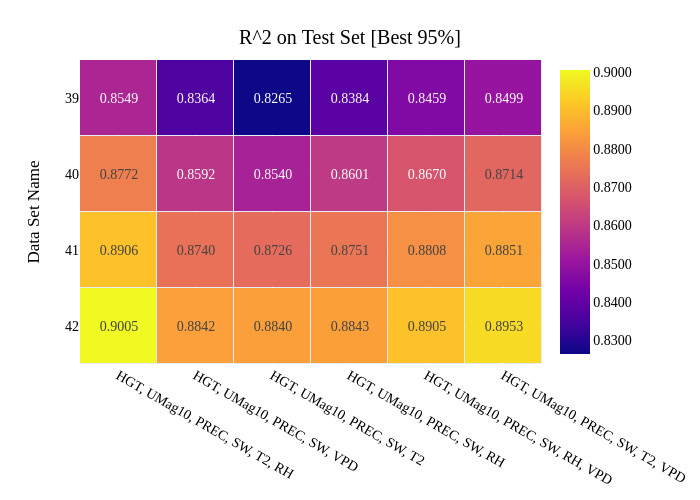
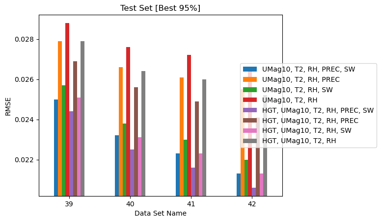

# Step 4: Evaluate Models

**Driver:** `Step4_EvalModels/EvaluateTrainedModels.py`
**Config:** `json_eval_sample.json`

## What this step does

[Step 3](step3-train.md) evaluates one (dataset, label, model) combination. Step 4
collects many of them into a **collection matrix** and produces comparative
heatmaps and bar plots, so you can see which combinations perform best.

This is where a parametric study becomes interpretable.

## The collection matrix

The matrix has two axes.

**Axis 1 — datasets.** `json_extract_counts` lists the Step 1 dataset
identifiers to include:

```json
"json_extract_counts": [39, 40, 41, 42, 43, 44, 45, 46, 47, 48, 49,
                        51, 52, 53, 55, 56, 59, 60, 61, 62, 63, 64, 65, 66]
```

**Axis 2 — (label, model) pairs.** `json_prep_train_maps` gives groups of label
and model identifiers, with human-readable descriptions used as plot legends:

```json
"json_prep_train_maps": [
    {
        "json_label": [6],
        "json_train": [3, 6, 7, 8],
        "set_info": ["UMag10, T2, RH"],
        "subset_info": ["PREC, SW", "PREC", "SW", ""]
    },
    {
        "json_label": [6],
        "json_train": [9, 10, 11, 12],
        "set_info": ["HGT, UMag10, T2, RH"],
        "subset_info": ["PREC, SW", "PREC", "SW", ""]
    }
]
```

Read the first group as: label configuration 6, trained four ways
(3, 6, 7, 8), all using the base feature set `UMag10, T2, RH`, with the four
variants adding `PREC, SW`, then `PREC` only, then `SW` only, then neither.

`set_info` and `subset_info` are purely descriptive — they label the plots. They
must correspond to what the referenced training configurations actually do;
nothing verifies this for you.

## Metrics and sets

```json
"metric_names": ["r2_score", "ev_score", "mse", "rmse", "max_err", "mae", "medae"],
"metric_on_sets": ["train", "test", "test_p90", "test_p95"]
```

Both are **lists you choose**. Each metric/dataset pair yields a heatmap, a bar
plot and a CSV, so the output scales with what you ask for: the seven-by-four
example above gives 28 pairs and **56 plots per collection**. Naming fewer of
either shrinks that proportionally.

!!! note "Selecting here does not discard anything"
    [Step 3](step3-train.md#regression-metrics) has already recorded all seven
    metrics on all four sets for every trained model. These lists control what a
    collection *aggregates and plots*, not what was computed — so narrowing them
    costs nothing permanently, and a metric left out today can still be
    collected later without retraining.

For classification problems, accuracy is the only metric; everything else is
identical.

## Locating the input files

Step 4 does not take the earlier JSON files as arguments. It reconstructs their
paths from a base directory plus the identifier lists:

```json
"paths": {
    "eval_model_base_loc": ".../04_Eval_Models",
    "sim_dir": ".../Wildfire_LDRD_SI",
    "json_extract_base": "InputJson/Extract/json_extract_data",
    "json_prep_base": "InputJson/Prep/json_prep_data_label",
    "json_train_base": "InputJson/Train/json_train_model"
}
```

Identifier `39` under `json_extract_base` resolves to
`<sim_dir>/InputJson/Extract/json_extract_data_039.json`. Identifiers are
**zero-padded to three digits**.

This means your JSON files must be organized in that directory layout for Step 4
to find them. See [Running on HPC](running-on-hpc.md#directory-layout).

## Naming the collection

```json
"evaluation": {
    "count": 1,
    "identifier_text": "many_cases"
}
```

These combine into the output directory name — `eval_001_many_cases`. Choosing a
descriptive `identifier_text` is what makes a large study navigable months later;
the archived collections use names like `temporal_data_effect` and
`RF_estimator_effect`.

## Example outputs



/// caption
R² on test data (best 95%) for several datasets and models.
///



/// caption
Root mean squared error on test data (best 95%) for a collection of datasets and
models.
///

## Output

Per collection, under `eval_model_base_loc`:

- 56 plots — a heatmap and bar plot for each metric/dataset pair
- Matching CSV files with the underlying numbers
- `<collection>_data_defn.csv` recording the parameters defining each dataset in
  the collection

The CSVs are the authoritative record; every result in the
[Science with MLAP](../science/overview.md) section is drawn from them. The
collections behind this documentation are published in the
[results archive](../science/overview.md#results-archive).
