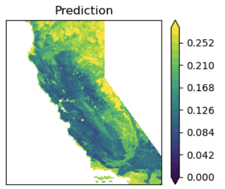
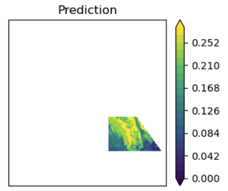
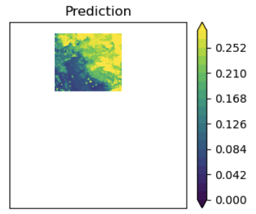

# Step 5: Analyze and Predict

**Drivers:** `Step5_Analyze/Analyze.py`, `Step5_Analyze/Analyze_RRM.py`
**Config:** `json_analyze.json`

## What this step does

Once [Step 4](step4-evaluate.md) has identified a good (dataset, model)
combination, Step 5 applies that trained model to **prescribed data** — a chosen
time and region — to produce a fuel map.

## Randomized versus prescribed data

This distinction runs through the whole pipeline:

| | Randomized | Prescribed |
|---|---|---|
| Reference times | Many, sampled across 21 years | One — the time you want |
| Grid points | Randomly sampled | Every point in the chosen region |
| Purpose | Training and testing | Prediction |

Prescribed data must be extracted and prepared **exactly as the training data
was** — same `max_history_to_consider`, same `history_interval`, same quantities.
A model trained on 41 features cannot be handed 61.

This is the lower path in the pipeline schematic on the [home page](../index.md).

## Specifying what to predict

`analysis_data_desired` selects which raw data sources to run against, and each
source gets a list of prediction requests:

```json
"analysis_data_desired": ["SJSU", "HRRR", "RRM"],
"SJSU": [
    {
        "RefTime": "2018-11-08_22",
        "regions_x_indices": [[250, 390], [100, 250]],
        "regions_y_indices": [[100, 200], [300, 450]]
    },
    {
        "RefTime": "2020-09-04_00",
        "regions_x_indices": [[250, 390], [100, 250]],
        "regions_y_indices": [[100, 200], [300, 450]]
    }
]
```

`RefTime` is the prediction time in `YYYY-MM-DD_HH` format. The region lists give
grid-index bounds, paired elementwise — the first x-range with the first y-range
forms region 1, and so on. **Regions may differ for each reference time.**

## Data sources

```json
"raw_data": {
    "SJSU": "/p/vast1/climres/DFM_reanalysis",
    "HRRR": "/p/vast1/climres/hrrr_liner1/monthly",
    "RRM":  "/p/vast1/climres/E3SM/RRM"
}
```

| Source | What it is |
|---|---|
| `SJSU` | The reanalysis dataset the models are trained on |
| `HRRR` | High-Resolution Rapid Refresh — operational weather, for near-term forecasts |
| `RRM` | E3SM regionally refined model — climate projections |

`Analyze_RRM.py` is a separate driver for the RRM data, which has its own
structure.

!!! note "Predicting outside the training envelope"
    Trained models can be applied to times and places outside the training data,
    including future forecasts and climate scenarios. What makes this work is the
    variable mapping defined in
    [Step 1](step1-extract.md#reading-other-data-sources) — as long as the new
    source has a counterpart for each quantity the model was trained on, it can
    be used.

## Example output



/// caption
10-hour FM prediction for the entire state of California at 2018-11-08_22.
///

<div class="grid" markdown>

/// caption
Sub-region 1
///


/// caption
Sub-region 2
///
</div>

The date above is during the Woolsey Fire, one of the events named in the Step 1
`fire_time_stamps` block:

```json
"fire_time_stamps": {
    "Woosley": {"Ref": "2018-11-08_22", "Start": "2018-11-01_00", "End": "2018-11-15_00"},
    "Creek":   {"Ref": "2020-09-04_00", "Start": "2020-08-28_00", "End": "2020-09-11_00"}
}
```

## Output

Under `analysis_data_base_loc`, for each requested time and region:

- FM contour maps for the full domain and each sub-region
- Scatter plots of prediction against ground truth, where ground truth exists

Ground-truth comparison is only possible for sources that carry FM values —
reanalysis data does, forecasts and projections do not. For those, the fuel map
is the product.
